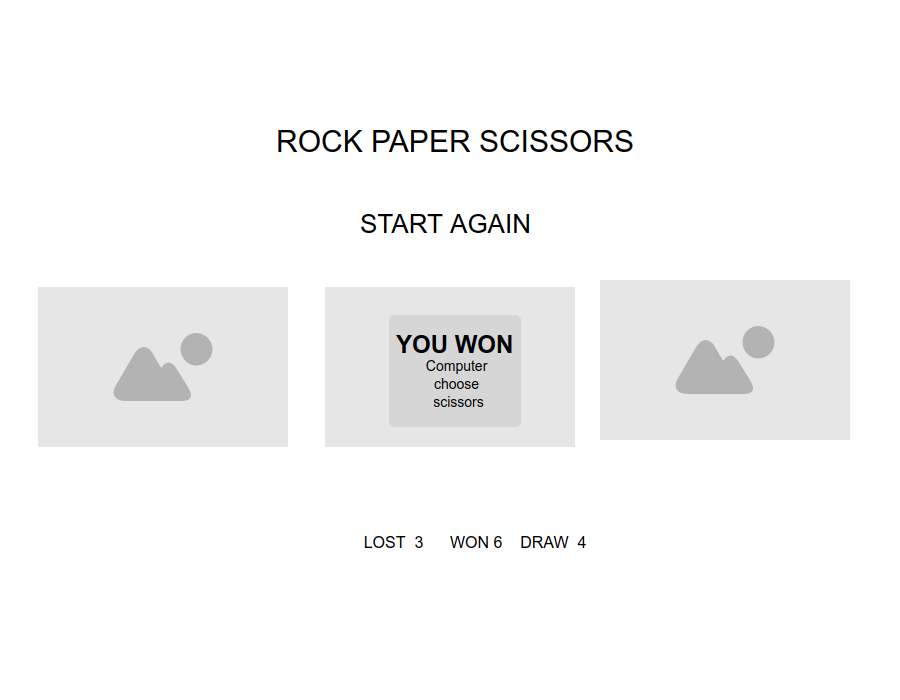
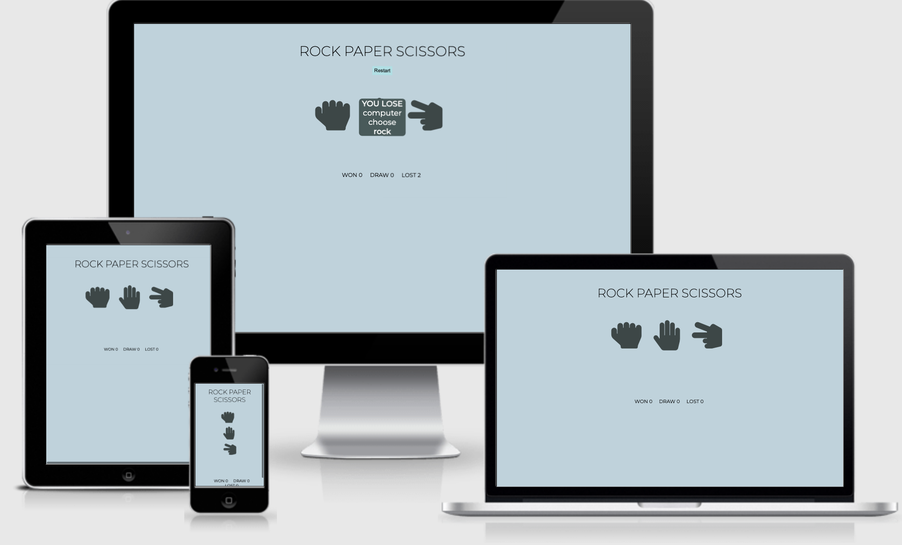
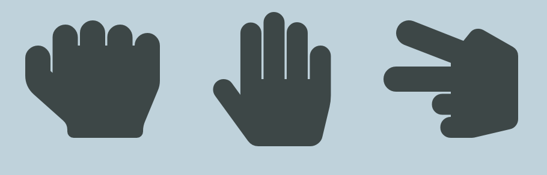
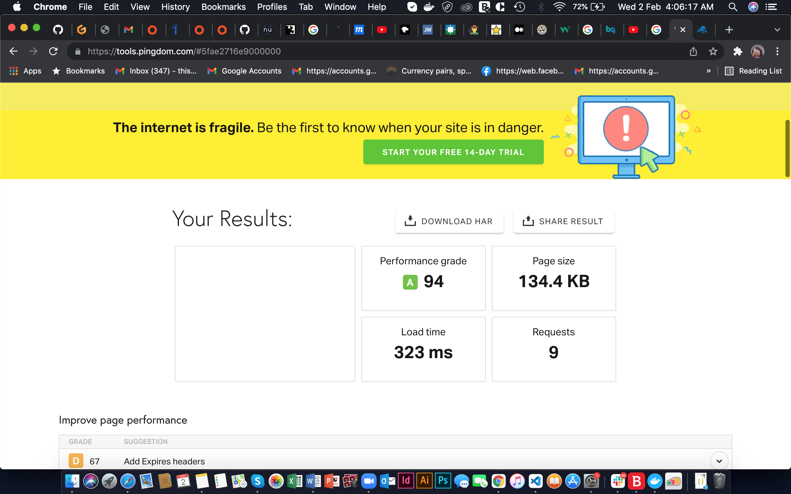

# ROCK PAPER SCISSORS

## Introduction

Rock Paper Scissors is a zero sum game that is usually played by two people using their hands and no tools. The idea is to make shapes with an outstretched hand where each shape will have a certain degree of power and will lead to an outcome.

### *Screenshot for mockup*

___

### *Screenshot of finished site*

___

## *Shape of rock, scissors and paper*
- `ROCK`: The rock is when you place your hand into the form of a simple fist.
- `PAPER`: The paper is when you place your hand in an outstretched position.
- `SCISSORS`: This is when you hold your fist with your index and middle finger pointing outwards in a V shape.

------

## Feature Icons

```
Rock, Scissors, Paper, are icons that a user clicks and the computer responds to the user
````
------

## Score Area

The score area increments when a user wins, lose, or when it is a draw

## Popup Button

- This is a button pops up when a player or computer wins, lose or when it is a draw 
- The button pops out when a user clicks any other thing on the site or clicks restart to restart the game
---

## Restart button

- This is a button restarts the game
---
## Testing

- Performance view: it previews the performance grade, page size, load time and request.

### Validator Testing
- CSS:
- HTML:

## Unfixed Bugs

## Deployment

## Credit


