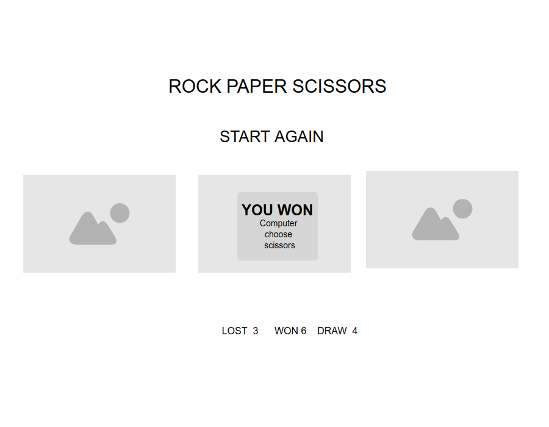
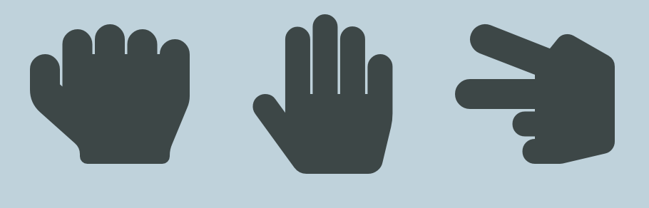
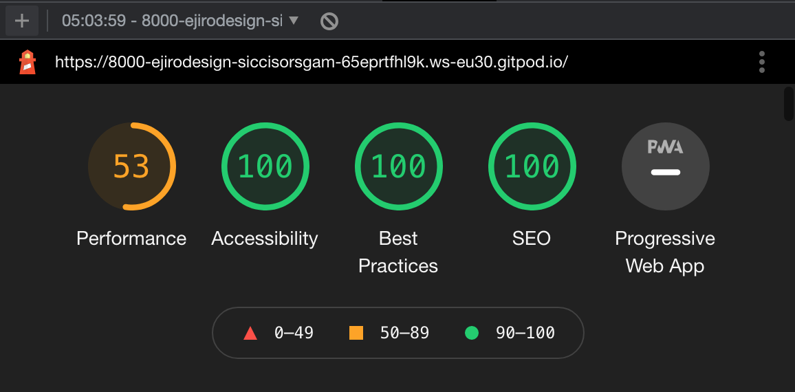

# ROCK PAPER SCISSORS

## Introduction

Rock Paper Scissors is a zero sum game that is usually played by two people using their hands and no tools. The idea is to make shapes with an outstretched hand where each shape will have a certain degree of power and will lead to an outcome.

### *Screenshot for mockup*

___

### *Screenshot of finished site*

___

## *Shape of rock, scissors and paper*
- `ROCK`: The rock is when you place your hand into the form of a simple fist.
- `PAPER`: The paper is when you place your hand in an outstretched position.
- `SCISSORS`: This is when you hold your fist with your index and middle finger pointing outwards in a V shape.

------

## Feature Icons

```
Rock, Scissors, Paper, are icons that a user clicks and the computer responds to the user
````
------

## Score Area

The score area increments when a user wins, lose, or when it is a draw

## Popup Button

- This is a button pops up when a player or computer wins, lose or when it is a draw 
- The button pops out when a user clicks any other thing on the site or clicks restart to restart the game
---

## Restart button

- This is a button restarts the game
---
## Testing the site
- step1: the user clicks on rock
- step2: the computer clicks paper
- step3: the popup message alerts the user of scores
- step4: the score area changes and shows the winner or the loser.


- Performance view: it previews the performance grade, page size, load time and request.

### Validator Testing
THE W3 CSS VALIDATOR:
- One error was found when pass through the W3C Validator
- Value Error : on line 119, to put a unit after a number 

- NU HTML Checker: 2errors found
- End tag for body seen, but there were unclosed elements From line 36, column 1; to line 36, column 7. and was corrected
- Unclosed element div, From line 15, column 5; to line 15, column 22, and was corrected.

## Unfixed Bugs
- 

## Deployment
- site was deployed to github pages using the necessary steps, attached is a link below

https://ejiro-design.github.io/siccisors-game/

## Technology
- Github: this is use to deploy the pages
- CSS: this for styling the site
- HTML: this is for the site structure
- JS: this is for site interaction between user and the computer

## Credit
- Solarwinds Pingdom
- The World Rock Paper Scissors Association (WRPSA)
- Digital Redneck | Vil Pietersen
- Travarsey Media on YouTube
- Buzz feed muiltplayer on YouTube
- freeCodeCamp.com on YouTube


